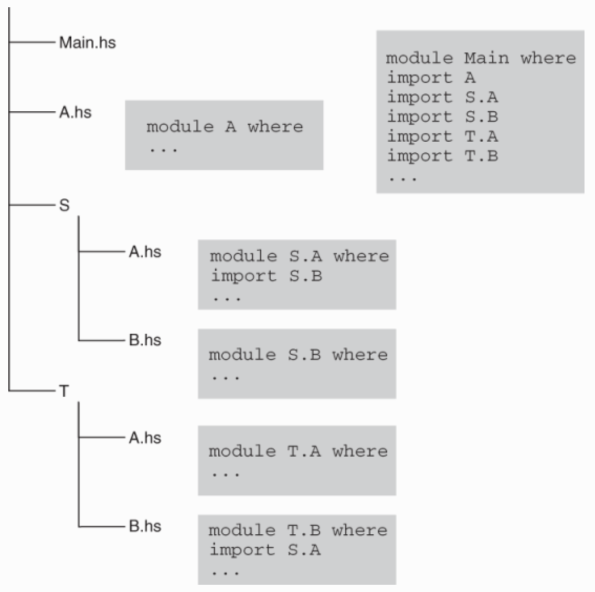

# Haskell-From-First-Principles

## Overview

This is my companion project to the book **haskell from first principles** that capture my learning journey.
It is organized as a multi-package haskell project.

Hence, in order to understand how to work with it, we use this readme opportunity to capture and introduce the knowledge related to how project/program are structure in haskell as well as the build tools used to manage and compile them.

## Haskell Stack Installation & Management

[[TODO]]


## An Introduction to Haskell Program Structure: Module, Package, Project

### Overview

- **The code in Haskell** (data types, function definitions, and so on) is organized into **modules**. One special module, **Prelude**, is imported into every module by default and exports the most important definitions. 

- **Modules form packages**, which may contain **libraries** intended to be used by other packages, **standalone applications**, or **both**. 

- **One special package**, **base**, contains the definitions from the **standard library** (as defined by the [Haskell 2010 Language Report](https://www.haskell.org/onlinereport/haskell2010/) together with **GHC-specific additions**. 

- Many professional applications **require working on many packages at the same time**, **so packages are organized into projects to allow application development**.

- Every Haskell programmer benefits from using libraries that have been created by other programmers. To that end, they must have been published and made available in the form of packages on [Hackage](https://hackage.haskell.org/), **the Haskell community’s central package archive**. That is, Packages deliver modules ready to be imported into programs.


### Module


- The **unit of compilation** in **Haskell** is a **module**.

- **A Module** contains datatypes, functions, typeclasses, typeclasses Instances and so on.

- It also serve as **namespace**.

- **The Haskell Report specifies the only role of a module to be a tool for namespace control and states that any multimodule program can (in theory) be transformed into a single-module program by copying every module entity from all the modules into a single file and then renaming some of those entities to prevent name clashes.**


- Nevertheless, it’s generally accepted that splitting any code into modules based on provided functionality (or other principles) makes it easier to maintain it and add new features.

- **A Module is akin to an Object in Scala, because it can contain instances**. In java it would be a static class.

- Although we said above that **a module is unit of compilation**, it is important to note that it does not work exactly as in **Scala**, where **the unit of compilation is a scala file**.

- The difference is that Haskell **enforce** that the **compilation unit i.e. file**, **must be one module**.

- In **Scala** you can have **multiple object** (akka module) in a **compilation unit**.

- So a more accurate definition is **a module is a namespaced unit of organization of code**.

- There is one special module called **Prelude**, and It is imported in all other module by default. It contains the most basic definition of the language.


### Package

- Package corresponds to jar in Java.

- Modules are distributed as Package.

- Module are compile as Package.

- A Package can be composed of multiple Modules.

- Like in Java, a Package (i.e. jar) can represent a library or an executable.

- **A Package can be an App (i.e. executable)** if it contains a **Main Module**.

- A Package can be both an App and a Library as in java.

- There is one  special Package called Base.

- The Base Package contains the default Prelude (Std Lib), together with GHC additions.

- Package are available on Hackage (hackage.haskell.org), the Haskell community central archive.


### Application (i.e. executable)


- **Every Haskell application is a collection of modules.**

- **There should be one module named Main, with the main function inside it**. This is an entry point to a program.

- The Main and all other modules contain datatype definitions, type classes, instances, functions, compiler pragmas, and other components.

- Every module potentially imports definitions from other modules of a program, the base library, and other libraries. A module can also export some of the definitions to make them available to others.


### Module Anatomy

- A module’s name should begin with an uppercase letter. 

- It is expected to reside in the .hs file with the same name ( _The only exception is the Main module, which is allowed to be placed elsewhere_)

  ```haskell
  module ModuleName (<export list>) where
   
    -- set of imports
   
    -- declarations for
    --  * type classes and instances
    --  * type synonyms and data types
    --  * functions
    --  * etc.
  ```

- Check the following reference for the rules on how to write import and export [Haskell in Depth - chapter 4 - Module structure, imports and exports, and module hierarchy](https://learning.oreilly.com/library/view/haskell-in-depth/9781617295409/OEBPS/Text/04.htm#heading_id_4)


- **A Module declaration without an Export list exports everything that is defined inside this module**


- **There are many options when writing import declarations** :

    - Import the whole module.

    - Import only specific names from the module by listing them in parentheses after the module name.

    - Import no names at all with an empty list of names (note that this imports all the instances because they have no names in Haskell).

    - Import names with optional or mandatory qualification with an alias (as) or a full module name to avoid name clashes.

    - Import all names except those listed after the hiding keyword.


- **An export list may contain any of the following**:

  - Names of the functions.
  
  - Names of the data types (type constructors), with or without data constructors (with the abbreviation (..), meaning all of them).
  
  - Names of the type classes, with or without method names.
  
  - A module name or its synonym prefixed with the module keyword for exporting all names imported from the corresponding module, or the namespace identified by the synonym. (**_ this kind of export is called reexporting._**)

  - **Note that instances of type class are always exported.**

    ```haskell
      module ModuleName (
        module X,                            ❶
        module Y,
        DataType1,                           ❷
        DataType2 (..),                      ❸
        DataType3 (Cons1, Cons2),            ❹
        TypeClass1,
        TypeClass2 (..),
        TypeClass3 (method1, method2),
        fun1, fun2,  fun3
      ) where
    ```

    ❶ Reexports everything from module X
    
    ❷ Only the type constructor is exported.
    
    ❸ Exports the type constructor with all data constructors
    
    ❹ Exports the type constructor with the two mentioned data constructors


### Module Hierarchy (Namespaces) and Directory Structure

- **Module Hierarchy a.k.a. Namespaces are constructed with Dot as in Java/Scala**  e.g. `Data.text`, `Control.Monad`, `Control.Concurrent`


- **There is a strict correspondence between the directory structure and the namespace hierarchy**. Hence, the example `Data.text` means we have a module `text` in the `data` directory (i.e. namespace) and the `data` directory itself, is at the **roots** of the **source directory**. 


- When importing or declaring a module, we must always use the full qualified name i.e. the module in the context of its namespace (directory hierarchy). 

  ```haskell
    -- Declaring a Module A inside a directory T & Importing a Module B defined in a directory Y
    
    Module T.A () where
      
      import Y.B
      
      -- ....
      -- ....
  ```

- It is important to note that the hierarchy start at the source roots where the module is defined. In the example above, even if Module B comes from an external package, the important thing is that the package is imported in the project and that the directory Y is at the source root of that package.

- 

- The figure below presents the correspondence between the actual position of a module file inside the directory structure, its name as specified in the module declaration, and the proper way to import it. We must adhere to this correspondence if we want GHC to compile a program. (_Not shown in the picture is the source root directory in which Main, A.hs, S, T are situated_)  

  


- It should be stressed that whenever we write import in a program, we import a particular module but not the whole module sub-hierarchy. Hierarchical module names are about naming only, and we shouldn’t expect anything else.


- **As well as being a key for the compiler to search files containing modules in the file system, a starting component of a module name says a lot to a programmer.** For example, common names at the top of the hierarchy include the following:

  - **Data** — Modules for working with data (both storing and processing). For example, Data.Map provides an associative container, and Data.Monoid declares the Monoid type class with the most important instances.  
  
  - **Control** — Used for control structures. For example, monads with many operations over them reside in Control.Monad, and tools to control concurrency are concentrated in Control.Concurrent.  
  
  - **System** — Collects OS-specific interfaces. For example, System.Environment allows communicating with the environment where our programs run.  
  
  - **Text** — Pertains to text processing. It contains the various parsing libraries, although the Text data type itself resides in Data.Text.

  - **Network** — Contains libraries for network processing. For example, the wreq package for writing HTTP requests provides the Network.Wreq module.


- **There are many other top-level categories. In fact, every library author is free to start a new category, although it is much more convenient for others to go with an existing one.** This helps you get an idea of what is provided by a library.


- **There are also conventional names that library authors are encouraged to use somewhere inside the hierarchy, including the following**:

  - **Internal** for implementation details normally hidden from users; for example, everything below Data.Conduit.Internal from the conduit library

  - **Tutorial** for examples of how to use the corresponding library, such as Control.Proxy.Tutorial from the pipes library


## Working with the Project

### Project Structure

 [[TODO]]

### First Steps

 [[TODO]]

## Haskell Project Development: A Deep Dive into Haskell Compilation, Dependency Management and The Packaging System & Tooling


 [[TODO]]