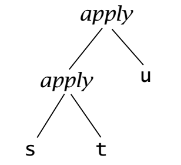

# Fundamentals


## Functional programing

The essence of functional programming is that programs are **a combination of expressions**. **Expressions include concrete values, variables, and also functions**. **Functions** have a more specific definition: **they are expressions that are applied to an argument or input and, once applied, can be _reduced_ or _evaluated_**.

Functional programming languages are all based on the **lambda calculus**. Some languages in this general category incorporate features that aren’t translatable into lambda expressions. Haskell is a pure functional language, because it does not.


The word **purity** in functional programming is sometimes also used to mean what is more properly called **referential transparency**.     
**Referential transparency** means that the same function, given the same values to evaluate, will always return the same result in pure functional programming, as they do in math  **_(This is a simplification)_**.


## Lambda Calculus

The lambda calculus has three basic components, or _lambda terms_: expressions, variables, and abstractions. 

- The word expression refers to a superset of all those things: an expression can be a variable name, an abstraction, or a combination of those things. 


- The simplest expression is a single variable. Variables here have no meaning or value; they are only names for potential inputs to functions. 


- An abstraction is a function. It is a lambda term that has a head (a lambda) and a body and is applied to an argument. 


- An argument is an input value. 


- Abstractions consist of two parts: the head and the body. The head of the function is a 𝜆 (lambda) followed by a variable name. The body of the function is another expression.

  > Example of function  
  > 
  > `λx.x`  

- The variable named in the head is the parameter and binds all instances of that same variable in the body of the function. That means, when we apply this function to an argument, each `x` in the body of the function will have the value of that argument.


- **The act of applying a lambda function to an argument is called application, and application is the lynchpin of the lambda calculus.**


- The lambda abstraction `λx.x` has no name. It is an anonymous function. _A named function can be called by name by another function; an anonymous function cannot._


- The dot (.) separates the parameters of the lambda from the function body. 


- The abstraction as a whole has no name, but the reason we call it an abstraction is that it is a generalization, or abstraction, from a concrete instance of a problem, and it abstracts through the introduction of names. 


- The names stand for particular values, but by using named variables, we allow for the possibility of applying the general function to different values (or, perhaps even values of different types). 


- When we apply the abstraction to arguments, we replace the names with values, making it concrete.


## Beta Reduction

- When we apply a function to an argument, we substitute the input expression for all instances of bound variables within the body of the abstraction. You also eliminate the head of the abstraction, since its only purpose is to bind a variable. This process is called _beta reduction_.

  > Example of application  
  > 
  > `(λx.x) 2`  
  > 
  > `2`

- Beta reduction is this process of applying a lambda term to an argument, replacing the bound variables with the value of the argument, and eliminating the head.

- Applications in the lambda calculus are left associative.

  > `(λx.x)(λy.y)z`
  >
  > is equivalent to
  >
  > `((λx.x)(λy.y))z`
  >
  > which reduce to
  >
  > `z`

- Beta reduction stops when there are no longer unevaluated functions applied to arguments.

- Sometimes, the body expression has variables that are not named in the head. We call those variables free variables.

  > `λx.xy`


## Multiple arguments


- Each lambda can only bind one parameter and can only accept one argument. **Functions that require multiple arguments have multiple, nested heads.** **When you apply it once and eliminate the first (leftmost) head, the next one is applied and so on.** This **formulation** was originally discovered by Moses Schönfinkel in the 1920s but was later rediscovered and named after **_Haskell Curry_** and is commonly called **_currying_**.

   > `λxy.xy`
   >
   > is a convienient shorthand for
   >
   > `λx.(λy.xy)`


- When applying the first argument, we’re binding `x`, eliminating the outer lambda, and **get `λy.xy` with `x` being whatever the outer lambda was bound to**.


- In functional Programing all functions take one argument and return one result.


## Evaluation is simplification

- There are multiple normal forms in lambda calculus, here we will focus and mean **beta normal form**. 


- **Beta normal form** is when you cannot beta reduce (apply lambdas to arguments) the terms any further. This corresponds to a fully evaluated expression, or, **in programming**, **a fully executed program**.

  > The expression 2000 / 1000 is not fully evaluated. The division function has been fully applied to two 
  > arguments, but it hasn’t yet been reduced or evaluated. In other words, there’s a simpler form it can be 
  > reduced to—the number two. The normal form, therefore, is 2.

- Application is what makes evaluation/simplification possible.

- Normal form means there is nothing left that can be reduced.

## Combinators

- A combinator is a lambda term with no free variables. Combinators, as the name suggests, serve only to combine the arguments they are given.


- We won’t have a lot to say about combinators, per se. The point is to call out a special class of lambda expressions that can only combine the arguments they are given, without introducing any new values or random data.


## Divergence


- Not all reducible lambda terms reduce to a normal form. This isn’t because they’re already fully reduced, but because they diverge. Divergence here means that the reduction process never terminates or ends.

  > Example of divergent lambda term called **omega**
  >
  > `(λx.xx)(λx.xx)`

Applying the first lambda to the argument give us back the same expression.


- **Divergence** matters in programming, because terms that _diverge_ are terms that **don’t produce an answer or meaningful result**. _Understanding what will terminate, means understanding what programs will do useful work and return the answer we want_.


## Closing statement

- **_Haskell_** is a lambda calculus. Actually, Haskell is a typed lambda calculus —more on types later— . That is, the meaning of Haskell programs is centered around evaluating expressions rather than executing instructions, although Haskell has a way to execute instructions, too.


- **_A lambda abstraction_** is an **anonymous function** or lambda term e.g. `(λx.x + 1)` .The head of the expression, `λx.`, abstracts out the term `x + 1`.


- **_In functional Programing_** all functions take one argument and return one result.


- **_Application_** is how one evaluates or reduces lambdas, binding the parameter to the concrete argument.


- **_Normal order_** is a common evaluation strategy in lambda calculi. Normal order means evaluating the leftmost, outermost lambdas first, evaluating nested terms after you’ve run out of arguments to apply. **Normal order isn’t how Haskell code is evaluated.** **Haskell’s evaluation strategy is** **_call-by-need_**, **instead**.


- **_Lambda calculus_** is a formal system for expressing programs in terms of abstraction and application.

 

## Complementary Materials

### Overview

The following are extra materials taken from the book _Types and Programing Languages - Part I - Untyped System - Chapter 5 - The Untyped Lambda-Calculus_

### Definitions

- The syntax of the lambda-calculus comprises just three sorts of terms. **A variable `x` by itself is a term**; **the abstraction of a variable `x` from a term `t1`, written `λx.t1`, is a term**; and **the application of a term t1 to another term `t2`, written `t1 t2`, is a term**. These ways of forming terms are summarized in the following grammar.

    ```haskell
    t ::=                    terms
         x                   variables
         λx.t                abstraction
         t t                 application
    ```

      t ::=                    terms
           x                   variables
           λx.t                abstraction
           t t                 application


- In the lambda-calculus everything is a function: the arguments accepted by functions are themselves functions and the result returned by a function is another function.


- Note that a constant `y` or a constant function that always return `y` would be written `λx.y`. That is, for ay input we always get y. But there is more to add constant to Lambda-calculus (see https://en.wikipedia.org/wiki/Lambda_calculus)


- Procedural (or functional) abstraction is a key feature of essentially all programming languages. Instead of writing the same calculation over and over, we write a procedure or function that performs the calculation generically, in terms of one or more named parameters, and then instantiate this function as needed, providing values for the parameters in each case.


- To save writing too many parentheses, we adopt two conventions when writing lambda-terms in linear form.

    - Application associates to the left, that is, `s t u` stands for `(s t) u`
  
        
  
    - The bodies of abstractions are taken to extend as far to the right as possible, so that, for example, `λx. λy. x y x` stands for the same tree as `λx. (λy. ((x y) x))`.

        

- An occurrence of the variable x is said to be bound when it occurs in the body t of an abstraction λx.t. (More precisely, it is bound by this abstraction. Equivalently, we can say that λx is a binder whose scope is t.) 


- An occurrence of x is free if it appears in a position where it is not bound by an enclosing abstraction on x. For example, the occurrences of x in x y and λy. x y are free, while the ones in λx.x and λz. λx. λy. x (y z) are bound. In (λx.x) x, the first occurrence of x is bound and the second is free. A term with no free variables is said to be closed; closed terms are also called combinators. The simplest combinator, called the identity function, id = λx.x; does nothing but return its argument.


### Operational Semantics

- In its pure form, the lambda-calculus has no built-in constants or primitive operators—no numbers, arithmetic operations, conditionals, records, loops, sequencing, I/O, etc. The sole means by which terms “compute” is the application of functions to arguments (which themselves are functions).

- Each step in the computation consists of rewriting an application whose left-hand component is an abstraction, by substituting the right-hand component for the bound variable in the abstraction’s body. Graphically, we write

  `(λx. t12) t2 ⟶ [x ⟼ t2] t12`


- Where it read as "**the expression** `(λx. t12) t2` **evaluate to** `[x ⟼ t2] t12` **the term obtained by replacing all free occurrence of x in to t12 by t2**"

- For example, the term `(λx.x) y` **evaluates to** `y` and the term `(λx. x (λx.x)) (u r)` **evaluates to** `u r (λx.x)`.


- A term of the form (λx. t12) t2 is called a redex (“reducible expression”), and the operation of rewriting a redex according to the above rule is called beta-reduction.


- Several different evaluation strategies for the lambda-calculus have been studied over the years by programming language designers and theorists. Each strategy defines which redex or redexes in a term can fire on the next step of evaluation.

  - Under **full beta-reduction**, any **redex** may be reduced at any time. At each step we pick some redex, anywhere inside the term we are evaluating, and reduce it. For example, if we consider the term
  
    > (λx.x) ((λx.x) (λz. (λx.x) z))
  
    which we can write more readably as 
  
    > id (id (λz. id z))
  
    This **term** contains three **redexes**:   
    
    > **id (id (λz. id z))**    
    > 
    > id **((id (λz. id z)))**  
    > 
    > id (id (λz. **id z**))
    
    Under _**full beta-reduction**_, we might choose, for example, to begin with the **innermost redex**, then do the one in the **middle**, then the **outermost**: 
  
    > id (id (λz. **id z**)) 
    > 
    > ⟶  id **(id (λz.z))** 
    > 
    > ⟶  **id (λz.z)** 
    > 
    > ⟶  λz.z 
    > 
    > ⟶

  - Under the **_normal order_** strategy, the **leftmost**, **outermost redex** is always reduced first. Under this strategy, the term above would be reduced as follows:

    > **id (id (λz. id z))**
    > 
    > ⟶  **id (λz. id z)**
    > 
    > ⟶  λz. **id z**
    > 
    > ⟶  λz.z 
    > 
    > ⟶
  
    Under this strategy (and the ones below), the evaluation relation is actually a partial function: each term t evaluates in one step to at most one term t 0

  - The **_call by name_** strategy is yet more restrictive, **allowing no reductions inside abstractions**. Starting from the same term, we would perform the first two reductions as under normal-order, but then stop before the last and regard **λz. id z** as a normal form:

    > **id (id (λz. id z))**
    > 
    > ⟶ **id (λz. id z)**
    > 
    > ⟶ λz. id z
    > 
    > ⟶

    **Variants** of _**call by name**_ have been used in some well-known programming languages, notably Algol-60 (Naur et al., 1963) and **Haskell** (Hudak et al., 1992). **Haskell actually uses an optimized version known as _call by need_ (Wadsworth, 1971; Ariola et al., 1995) that, instead of re-evaluating an argument each time it is used, overwrites all occurrences of the argument with its value the first time it is evaluated, avoiding the need for subsequent re-evaluation.** This strategy demands that we maintain some sharing in the run-time representation of terms—in effect, it is a reduction relation on abstract syntax graphs, rather than syntax trees.

  - **Most languages** use a **_call by value_** strategy, in which **only outermost redexes are reduced and where a redex is reduced only when its right-hand side has already been reduced to a value—a term that is finished computing and cannot be reduced any further**. Under this strategy, our example term reduces as follows:

    > id (**id (λz. id z)**) 
    > 
    > ⟶ **id (λz. id z)** 
    > 
    > ⟶ λz. id z 
    > 
    > ⟶

    The **_call-by-value_** strategy is **strict**, in the sense that **the arguments to functions are always evaluated, whether or not they are used by the body of the function**. **In contrast, non-strict _(or lazy)_ strategies such as _call-by-name_ and _call-by-need_ evaluate only the arguments that are actually used.**


### Multiple Arguments

To begin, we shall observe that the **lambda-calculus** provides **no built-in support for multi-argument functions**. Of course, this would not be hard to add, but it is even easier to achieve the same effect **using higher-order functions that yield functions as results**.

Suppose that `s` is a term involving two free variables `x` and `y` and that we want to write a function `f` that, for each pair `(v,w)` of arguments, yields the result of substituting `v` for `x` and `w` for `y` in `s`.   
Instead of writing `f = λ(x,y).s`, as we might in a richer programming language, we write `f = λx.λy.s`.  
That is, `f` is a function that, given a value `v` for `x`, yields a function that, given a value `w` for `y`, yields the desired result.   
**We then apply `f` to its arguments one at a time**, writing `f v w (i.e., (f v) w)`, which reduces to `((λy.[x ⟼ v]s) w)` and thence `to [y ⟼ w][x ⟼ v]s`.`  

**This transformation of multi-argument functions into higher-order functions is called currying in honor of Haskell Curry.**


## _Wrap up Note & Reflections_


- One can wonder what is the meaning of xyz in the self standing term xyz or as part of an λx.xyz. Do we actually have application here ((x y) z). The answer is yes. That is, `x apply to y` and the result of it `(x y) apply to z`. However, the above may feel strange to some at start. Some help to understand is provided in what follow

- As state in https://stackoverflow.com/questions/31546381/lambda-calculus-reductions

    > There is typically no reduction rule for applying a variable to a variable. This is generally why we use a type system, to ensure that for any well-typed program, when we evaluate we never "get stuck" as we did in step 3.

- So on the one hand, typed lambda calculus would make sure that we can always reduce to something meaningful, but on the other hand, from a pure untyped Lambda-Calculus point of view, it is also important to remind ourselves, that variables can be substituted by functions.


